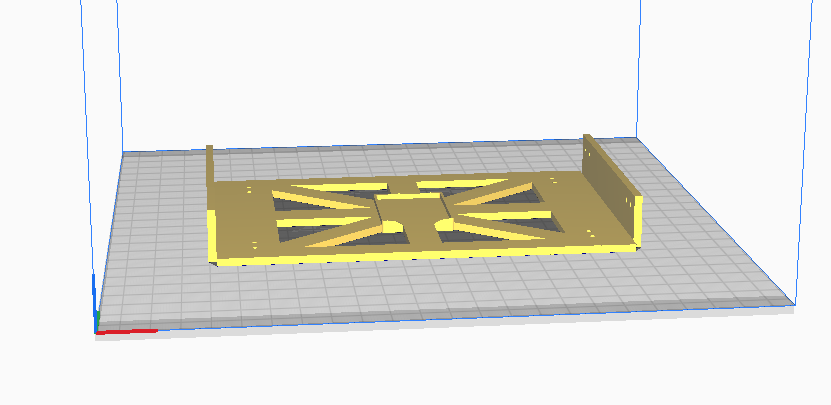
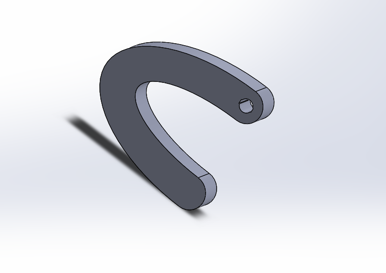
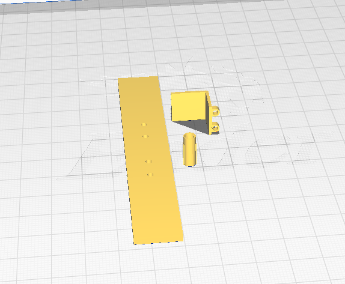
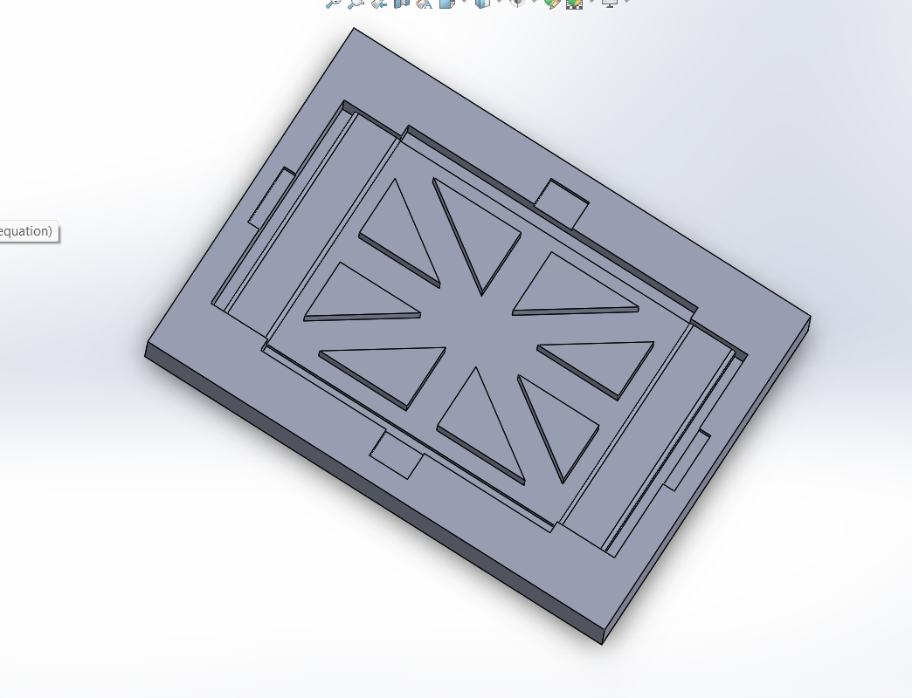
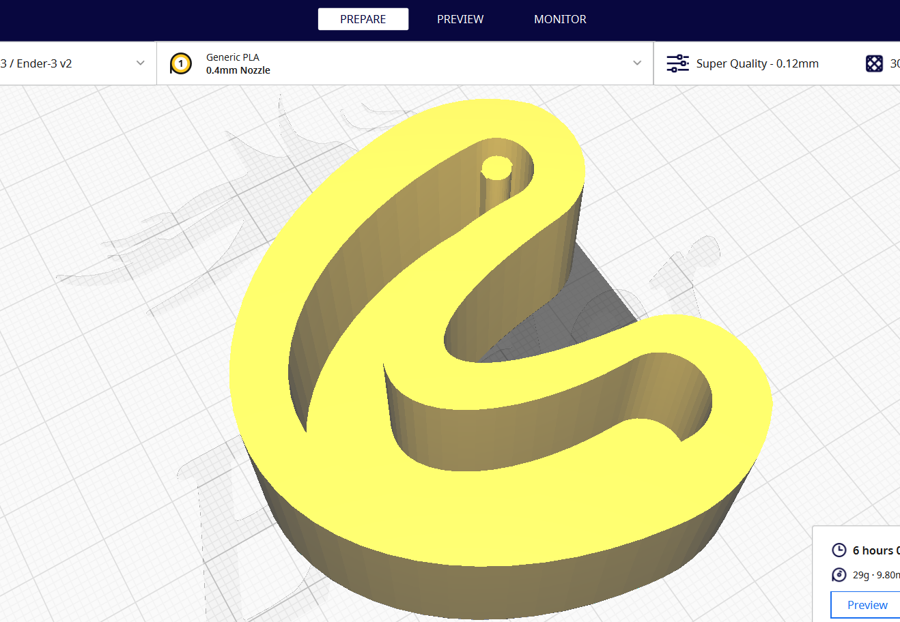

# <ins>CAD Design
## <ins>Rigid Bot PArts:

Rigid Bot Chasis Design

Rigid Leg Chasis Design

Other parts used in Bot

## <ins>Asembly of Bot:

Motion of Bot Assembly

## <ins>Molds used for Soft Part Fabrication:

Body Mold

Leg Mold
