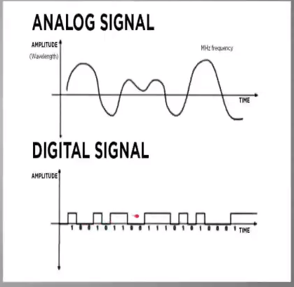
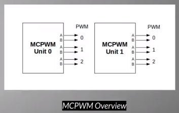

## Signals:

1. Analog Signals: Signals are simply wave of any shapeand have any range of value. The values are continously varying.
2. Digital Signals: Its is a Square wave.The values is either MInimum or Maximum

# PWM(Pulse Width Modulation):
- Technique used to get analog results with digital means
- pulse width is the duration when the signal is high
- **Duty Cycle** is the ratio of ON time to the Time of the period of cycle(ON time +OFF Time)
- **Advantages:** Helps in preventing overheating while maintaining the process, Has a good Control & Response Time(Better Precision).
- **Applications:** Controlling Brightness, Controlling Speed of Motors, Control of fan to help dissipate heat from Devices, To decode and encode in Telecommunication
## ESP32 MCPWM:
- LED needs faster response so the PWM used has Faster Response and Low Resolution(8bit), whereas Motor Control needs a high resolution response, So MCPWM has a bit slower response and provides high resolution(16 bit) the values are in range 0 to 65535(2^16)
- In ESP32 there are 2 units of MCPWM whereeach has 3 pair of output to control different types of Motor

